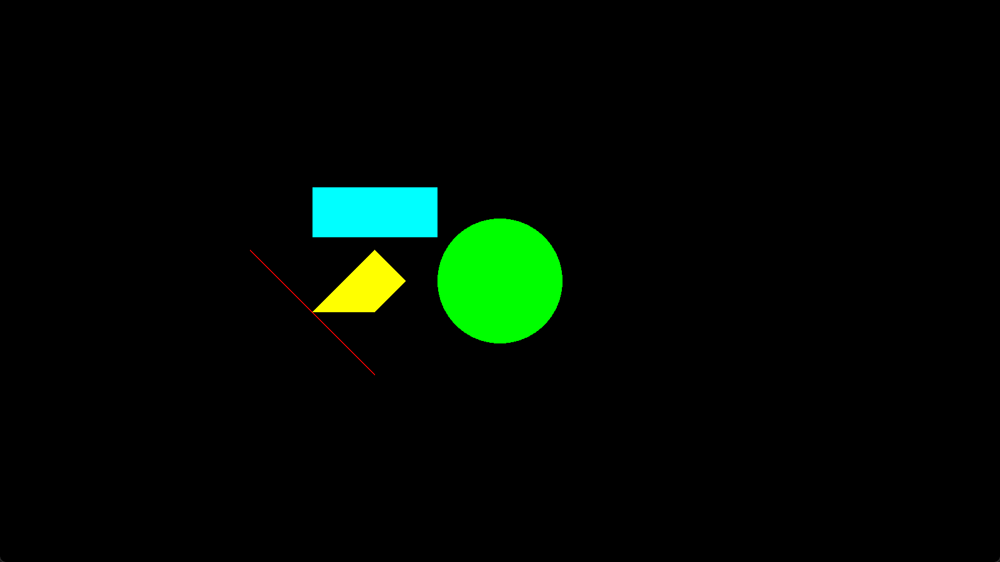

# raincloud
Simplified C++ 2D game library for Windows.  
**Please add `$(SolutionDir)YOUR_PROJECT_NAME\raincloud\include\freetype\include` to `Additional Include Directories` tab in Visual Studio before compile it.**  
**+Check x86 as a target platform in Visual Studio**

## Features
- Image rendering
- Font rendering
- Shape rendering
- Playing audio files
- Camera implementation

## Example

```cpp
#include "raincloud.h"
using namespace rc;

Camera cam = Camera();

void process(double deltaTime, FrameEvent event) {

}

void draw() {
	draw_line(cam, { 400, 400 }, { 600, 600 }, 2, { 1, 0, 0, 1 });
	draw_circle(cam, { 800, 450 }, 100, { 0, 1, 0, 1 });
	draw_rect(cam, { 500, 300 }, { 200, 80 }, { 0, 1, 1, 1 });
	draw_polygon(cam, { {500, 500}, {600, 400}, {650, 450}, {600, 500} }, { 1, 1, 0, 1 });
}

int main() {
	if (init_window("hello world", vec2(160, 90), vec2(1600, 900)) != WINDOW_CONDITION::SUCCESS) {
		return EXIT_FAILURE;
	}
	register_process_func(process, draw);
	set_background_color({ 0, 0, 0, 1 });
	start_main_loop();
	uninit_window();
}
```

## Thirdparty
- [GLFW](https://www.glfw.org/) -  zlib license

- [GLAD](https://glad.dav1d.de/) - MIT license

- [glm](https://github.com/g-truc/glm) - MIT license

- [freetype](https://freetype.org/) - FreeType license

- [stb](https://github.com/nothings/stb) - MIT license

- [miniaudio](https://miniaud.io/) - MIT-0 license

